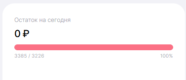
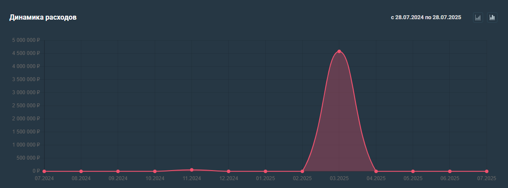

# Веб-приложение

## Содержание

- [Веб-приложение](#веб-приложение)
  - [Содержание](#содержание)
- [Header](#header)
- [Footer](#footer)
- [Главная страница для неавторизованных пользователей](#главная-страница-для-неавторизованных-пользователей)
- [Авторизация](#авторизация)
- [Регистрация](#регистрация)
- [Главная страница для авторизованных пользователей](#главная-страница-для-авторизованных-пользователей)
  - [Панель-меню](#панель-меню)
  - [Дашборд](#дашборд)
  - [Аналитика](#аналитика)
  - [Операции](#операции)
  - [Счета, цели, бюджет](#счета-цели-бюджет)
  - [Настройки](#настройки)
- [Краткая выжимка о приложении](#краткая-выжимка-о-приложении)
    - [Страница "О нас"](#страница-о-нас)
- [Мобильное приложение](#мобильное-приложение)

<a id="header">

# Header

</a>

* Слева находится логотип, и сразу же после него название. И логотип и название является ссылкой на главную старницу
* Header одинаковый на всех листах( используется на странице неавторизованного пользователя,регистрации, авторизации)
* В случае отображения на телефоне логотип и название отображаются также слева
* Кнопка "Войти" отображается в шапке,в случае, если пользователь не авторизован

<a id="footer">

# Footer

</a>

* Находится информация о разработчиках(тг, вк, почта)
* Информация о местонахождении офиса, данные организации

<a id="main_unauthorized">

# Главная страница для неавторизованных пользователей

</a>

* Состоит из информации о приложении, страница чем-то напоминает тильдовские сайты
* Данные на странице должны появлятся по мере пролистывания страницы вниз
* первым блоком(по моим представлениям) справа телефоны, наклоненные с изображение разных графиков и статистик, краткая выжимка о приложении, выжимка описана [здесь](#Краткая_выжимка)
* Затем идет блок с блоками, где показаны фтогорафии и основные функции приложения, на странице ПК версии отображено 3 блока, в телефонной - 1 блок, его можно перелистывать
* Затем идет описание шагов для пользования приложением, также с какими-нибудь графиками
* Отзывы, показаны также блоками
* Пример структуры можно посмотреть [здесь](https://www.spendee.com/)

<a id="авторизация">

# Авторизация

</a>

* Авторизация является отдельной страницей, блок с авторизацией находится по середине страницы
* Присутствует надпись "Авторизация", а ниже находятся два блока: блок логин и блок с паролем
* Над блоком "Логин" находится надпись "Электронная почта", внутри самого логина написано "example@gmail.com"
* Над блоком "Пароль" находится надпись "Пароль" при вводе пароля он отображается точками, но есть возможность его увидеть
* И на стороне сервера и на стороне клиента произведена обработка ошибок
* Ниже есть значки того, через какую систему можно сделать авторизацию(например, Яндекс или ВК)
* Еще ниже находится надпись "У вас еще нет аккаунта? [Зарегистрируйтесь](#Регистрация)

<a id="Регистрация">

# Регистрация

</a>

* Это является отдельной страницей
* Присутствует надпись "Регистрация", ниже находятся 3 блока
* Над блоком "Логин" находится надпись "Электронная почта", внутри самого логина написано "example@gmail.com"
* Над блоком "Пароль" находится надпись "Пароль" при вводе пароля он отображается точками, но есть возможность его увидеть
* Над блоком "Подтвердить пароль" находится надпись "Подтвердить пароль" при вводе пароля он отображается точками, но есть возможность его увидеть
* И на стороне сервера и на стороне клиента произведена обработка ошибок

<hidden>

<a id="main_authorized">

# Главная страница для авторизованных пользователей

</a>

* Слева находится панель-меню, она используется на всех листах для авторизованных пользователей, подробное ее описание можно увидеть [здесь](#панель_меню) 
* Начальной страницей с меню является страница с [дашбордом](#дашборд)

<a id="панель_меню">

## Панель-меню

</a>

* Сверху находится логотип и название
* Затем перечислены страницы, страницы будут следующими:
  1) [Дашборд](#дашборд) (какая-нибудь иконка)
  2) [Аналитика](#аналитика)(также какая-нибудь иконка, например, с каким-нибудь графиком)
  3) [Операции](#операции) (иконка)
  4) [Счета, цели, бюджет](#счета_цели_бюджет) (иконка)
  5) [Настройки](#настройки) (иконка - банальная шестерёнка)
* Ниже находятся различные маленькие окошки с какими-то показателями, например, валюты. цена золота, цена акций

<a id="дашборд">

## Дашборд

</a>

* На дашборде находятся следующие виды графиков
  1) Общий график доходов и расходов 
        1.1) Рядом с графиком есть фильтр, где есть возожность переключаться,показывая "доход" или "расход"
  2) Остатки от распланированных бюджетов на сегодня пример находится ниже: 
    
    3) Окно со статистикой о том, сколько денег пришло или ушло на определенный счет,бюджет или цель за определенный период, также показывается текущая сумма на счете
    4) График с динамикой расходов и доходов по всем счетам, есть фильтр для конкретного счета, бюджета, цели, пример графика 
   
    5) Диаграмма расходов на определенный период по категориям
    6) Окошко с фильтром о том, информацию по какому пользователю из семьи посмотреть(в настройках пользователь может настроить, какую информацию о себе показывать членам семьи, по умолчанию - всю)

<a id="аналитика">

## Аналитика

</a>

<a id="операции">

## Операции

</a>

<a id="счета_цели_бюджет">

## Счета, цели, бюджет

</a>

<a id="настройки">

## Настройки

</a>

<a id="Краткая_выжимка">

# Краткая выжимка о приложении

</a>

<a id="блок--о-нас">

### Страница "О нас"

</a>

# Мобильное приложение

1) Все блоки с главной страницы переходят вниз и отображаются иконкой

</hidden>